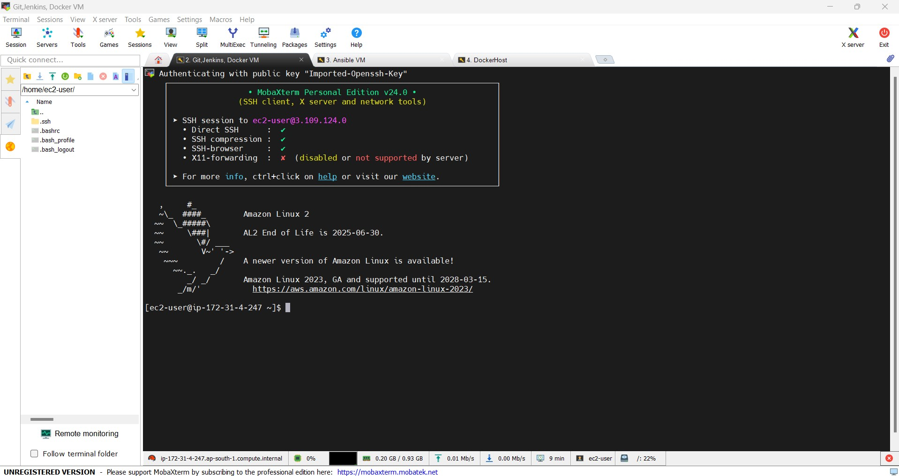

# CI/CD Project: Web Server Deployment with Docker

## Table of Contents
1. [Introduction](#introduction)
2. [Technologies Used](#technologies-used)
3. [Project Architecture](#project-architecture)
4. [Setup and Installation](#setup-and-installation)
5. [Step-by-Step Process](#step-by-step-process)
6. [Console Output](#Console-Output)
7. [Conclusion](#conclusion)
8. [Contact Information](#contact-information)

## Introduction
This project demonstrates a Continuous Integration and Continuous Deployment (CI/CD) pipeline using Git, Jenkins, Ansible, Docker, and an HTTPD server. The pipeline automates the deployment of a Python web application using Tornado, ensuring consistent and reliable delivery.

## Technologies Used
- **Git**: Version control
- **Jenkins**: Continuous integration server
- **Ansible**: Configuration management and orchestration tool
- **Docker**: Containerization platform
- **Tornado**: Python web framework

## Project Architecture


## Setup and Installation

### Step 1: Launch Instances
- Launch instances with Amazon Linux 2.
- Connect using Putty/MobaXterm.
- Modify instance security inbound rules to allow custom TCP 8080.




### Step 2: Configure Git, Jenkins, and Docker in VM

**Git Installation**
1. Switch to root user: `sudo -i` or `sudo su`
2. Update packages: `sudo yum update`
3. Install Git: `sudo yum install git`
4. Verify Git installation: `git --version`

**Jenkins Installation**
1. Switch to root user: `sudo su -`
2. Add Jenkins repo: `sudo wget -O /etc/yum.repos.d/jenkins.repo https://pkg.jenkins.io/redhat-stable/jenkins.repo`
3. Import Jenkins key: `sudo rpm --import https://pkg.jenkins.io/redhat-stable/jenkins.io-2023.key`
4. Install Java 11: `amazon-linux-extras install java-openjdk11 -y`
5. Install Jenkins: `yum install jenkins -y`
6. Enable and start Jenkins:
    ```sh
    systemctl enable jenkins
    systemctl start jenkins
    systemctl status jenkins
    ```
7. Retrieve Jenkins initial admin password: `cat /var/lib/jenkins/secrets/initialAdminPassword`
8. Access Jenkins UI: `http://<Public-IPv4-address>:8080/` and complete the setup.

**Docker Installation**
1. Switch to root user: `sudo su -`
2. Install Docker: `sudo yum install docker -y`
3. Verify Docker version: `docker --version`
4. Enable and start Docker:
    ```sh
    sudo systemctl enable docker
    sudo systemctl start docker
    ```

### Step 3: Install Ansible on VM
1. Switch to root user.
2. Update packages: `sudo yum update -y`
3. Install Ansible: `sudo amazon-linux-extras install ansible2 -y`
4. Verify Ansible installation: `ansible --version`

### Step 4: Docker Installation on Docker Host VM
1. Switch to root user: `sudo su -`
2. Update packages: `sudo yum update -y`
3. Install Docker: `sudo yum install docker -y`
4. Verify Docker version: `docker --version`
5. Enable and start Docker:
    ```sh
    sudo systemctl enable docker
    sudo systemctl start docker
    ```

### Step 5: Configure Jenkins and GitHub Integration
1. In Jenkins, generate API token: Jenkins -> User -> Configure -> API token -> Generate and save it.
2. In GitHub, create a new repository and add a webhook: Settings -> Webhooks -> Add webhook -> Paste Jenkins API token into the secret field.
3. Install Jenkins plugins: Manage Jenkins -> Plugins -> Available plugins -> Install "Publish Over SSH" plugin and restart Jenkins.


### Step 6: Establish SSH Connections Between Machines
1. Publish the connection between 2 VMs (Jenkins-Ansible-Docker) using SSH.
2. Generate SSH keys: `ssh-keygen`
3. Set root password: `passwd root`
4. Edit SSH configuration: `vi /etc/ssh/sshd_config`
    - Uncomment `PermitRootLogin yes`
    - Change `PasswordAuthentication no` to `yes`
5. Restart and enable SSH:
    ```sh
    systemctl restart sshd
    systemctl enable sshd
    ```
6. Test SSH connections: `ssh root@<private IP>`
7. Copy SSH key to Ansible server: `ssh-copy-id -i root@<private IP of Ansible server>`
8. Verify connection and exit: `ssh root@<private IP of Ansible server>`

### Step 7: Configure Jenkins & Ansible SSH Server
1. Add SSH server: Jenkins -> Dashboard -> System -> SSH Server.
2. Test connection with Jenkins and Ansible servers.


### Step 8: Create Dockerfile, requirements.txt, and server.py

**Dockerfile**
```Dockerfile
FROM python:3.8

COPY . /app
WORKDIR /app

RUN pip install -r requirements.txt

CMD ["python", "-u", "server.py"]
```

**requirements.txt**
```
tornado
```

**server.py**
```python
import tornado.ioloop
import tornado.web

class MainHandler(tornado.web.RequestHandler):
    def get(self):
        self.write("Hello, world\n")
        print(self.request)

def make_app():
    return tornado.web.Application([
        (r"/", MainHandler),
    ])

if __name__ == "__main__":
    app = make_app()
    app.listen(8888)
    tornado.ioloop.IOLoop.current().start()
```

Push these files to GitHub and verify.

### Step 9: Playbook and Docker Hub Repository Creation
1. Go to Docker Hub online and create a repository.
2. Copy the path of your Docker account and repository for adding it into the playbook.
3. Go to Ansible VM and create a playbook in `/opt/` location:
    ```sh
    cd /opt/
    vi docker.yaml
    ```
    **docker.yaml**
    ```yaml
    ---
    - hosts: webservers
      tasks:
        - shell: docker run -p 80:8888 charandevopsdocker/mypyrepo:mypyimg
    ```

### Step 10: Create Jenkins Pipeline
1. Source Code Management: Git.
2. Build Triggers: GitHub hook trigger for GITScm polling.
3. Build Steps: Send files or execute commands over SSH.
    - Configure Jenkins Exec command:
        ```sh
        cd /var/lib/jenkins/workspace/cicdtest
        docker build -t mypyimg .
        docker tag mypyimg charandevopsdocker/mypyrepo:mypyimg
        docker push charandevopsdocker/mypyrepo:mypyimg
        ```
4. Post-build Actions: Send build artifacts over SSH.
    - Configure Ansible Exec command:
        ```sh
        ansible-playbook /opt/docker.yaml
        ```
5. Apply and save, go to homepage and click on build now.
6. Copy the public IP address of the Docker host VM and check on the browser, it will show "Hello, world" as output.


## Console Output


## Conclusion
This project demonstrates the successful implementation of a CI/CD pipeline using Git, Jenkins, Ansible, Docker, and a Python web application using Tornado. It automates the deployment process, ensuring efficient and reliable application delivery.

## Contact Information
For any queries, feel free to contact me at [sscharan95@gmail.com].